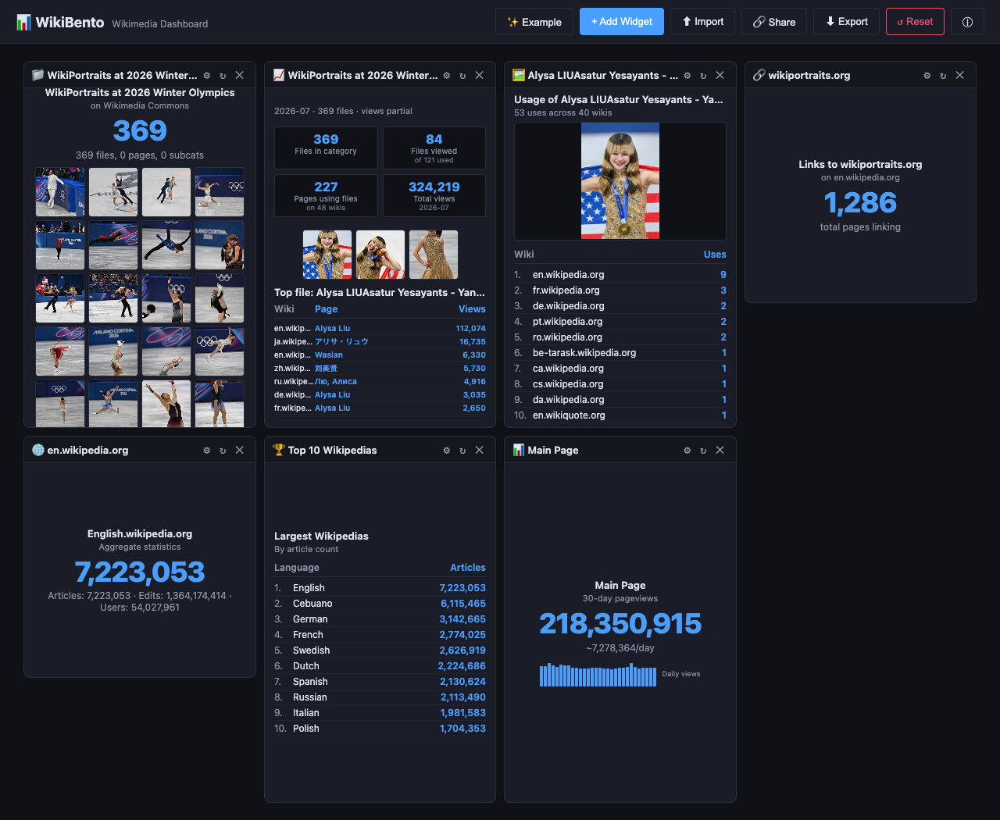

# 📊 WikiBento — Wikimedia Dashboard



WikiBento is a drag-and-drop dashboard for Wikimedia — a single board for
keeping an eye on things and acting on them. Wikimedia's data and activity
live across many places: pageview and stats APIs, wiki pages, recent changes,
Commons. WikiBento brings what you care about into one place — starting with
metrics like article pageviews, external link counts, category sizes, file
usage, and GLAM-style impact stats, and extending to listings and feeds you
can click through and act on, like recent changes and usage trails.

It's a single-page React app built on
[react-grid-layout](https://github.com/react-grid-layout/react-grid-layout)
(the same grid engine used by Grafana and Kibana), ≈373 KB total (~112 KB
gzipped), hostable as static files on Toolforge or anywhere.

All widgets hit **real Wikimedia APIs** (RESTBase, MediaWiki Action API,
Commons, Wikistats) directly from the browser — no backend, no login, no proxy.

**Live:** [wikibento.toolforge.org](https://wikibento.toolforge.org/)

**Example:** [Alysa Liu](https://wikibento.toolforge.org/?config=https://w.wiki/TR9R)

**Source**: [github.com/fuzheado/wikibento](https://github.com/fuzheado/wikibento)

---

## Try It (demo file)

A ready-made 7-widget dashboard config is hosted on Wikimedia Commons. Open
the app with this URL and the whole dashboard loads immediately:

```
https://wikibento.toolforge.org/?config=https://commons.wikimedia.org/wiki/Commons:WikiPortraits/Bento-demo.json
```

(Or use a [w.wiki](https://w.wiki) short link for the same config: `?config=https://w.wiki/TR9R` — expanded automatically via the same-origin `/api/resolve` endpoint.)

(The file is plain JSON — see [docs/JSON-FORMAT.md](docs/JSON-FORMAT.md). Any
on-wiki page, GitHub raw file, or CORS-enabled host works the same way.)

## Widget Catalog

| Widget | Icon | Data Source | Shows |
|---|---|---|---|
| **Article Pageviews** | 📊 | [RESTBase Pageviews API](https://wikimedia.org/api/rest_v1/) | 30-day total + daily sparkline + avg/day for any article |
| **External Link Count** | 🔗 | MediaWiki API `exturlusage` | Count of pages linking to a domain (up to 5,000; **namespace-filterable** — e.g. articles only) |
| **Category Size** | 📁 | MediaWiki API `categoryinfo` | File/page/subcat breakdown for any category (Commons or enwiki), with optional **random photo sample** |
| **Wiki Stats** | 🌐 | [Wikistats (s23) CSV API](https://wikistats.wmcloud.org/) | Articles, edits, users for a language edition |
| **File Usage Map** | 🖼️ | Commons API `globalusage` + `imageinfo` | Per-wiki breakdown of where a file is used, with optional **image preview + summary caption** |
| **Top 10 Wikipedias** | 🏆 | [Wikistats (s23) CSV API](https://wikistats.wmcloud.org/) | Ranking table of largest Wikipedias by article count |
| **GLAM Category Usage** | 📈 | Commons API + WMF pageviews (GLAMorgan-style) | Files/used/pages/views for a category tree + month, top-image filmstrip, per-page usage detail |
| **Top Wikipedia Articles** | 🔥 | [top.hatnote.com](https://top.hatnote.com) (via same-origin proxy) + [WMF pageviews top](https://wikimedia.org/api/rest_v1/) fallback + MediaWiki `pageimages|extracts` enrichment | Most-visited articles for any of 28 Wikipedia languages — latest day or any date, top-N (all/10/arbitrary), default noise filter (.xxx, XXX (beer)…), optional **expanded view** with thumbnail + intro per row |
| **Article Excerpt** | 📄 | [REST `/page/summary`](https://en.wikipedia.org/api/rest_v1/page/summary/Ada_Lovelace) | First paragraph + short description + thumbnail for any article, linked to the page |
| **Edit History** | 🕓 | MediaWiki API `prop=revisions` | Recent edits newest-first — user, time, comment, and byte delta per edit |
| **Article Quality (ORES)** | 🏅 | [Lift Wing](https://api.wikimedia.org/) `enwiki-articlequality` (falls back to the modern continuous `articlequality` model) | Predicted FA/GA/B/C/Start/Stub class with per-class probability distribution for any article |
| **WikiProject Assessment** | 🧭 | MediaWiki API `prop=pageassessments` | Quality class + importance per WikiProject banner (enwiki and other PageAssessments wikis) |
| **Article Gallery** | 🖼️ | [REST `/page/media-list`](https://en.wikipedia.org/api/rest_v1/page/media-list/Albert_Einstein) + `imageinfo` | Significant images with captions — grid (small/medium/large) or list (thumb left, caption right); filters out uncaptioned flags/logos/maps and tiny icons |
| **Commons File Gallery** | 🗂️ | Commons API `imageinfo` (batched) | Gallery of any Commons files you list (one per line) — grid or list; order as-listed / random / alphabetical / largest-first; missing files counted |
| **Article List** | 📋 | MediaWiki API `pageimages\|extracts` (batched, optional) | Clickable list of pasted article titles — optional thumbnails + intros |
| **SPARQL Query** | 🧠 | [WDQS](https://query.wikidata.org/sparql) + [QLever](https://qlever.dev/api/wikimedia-commons) + Humaniki | Run any SPARQL (Wikidata or Commons SDC) — big number, bar chart, line, or table (auto-detected from the result shape, with manual override); 4 curated presets incl. collection depth and the Women-in-Red % (precomputed via Humaniki) |
| **Wiki Page** | 📄 | (static — iframe to the wiki) | Embed any MediaWiki page — desktop or **mobile view (`?useformat=mobile`)**; links browse inside the widget; optional section anchor |
| **360° Panorama Viewer** | 🌐 | Commons `imageinfo` + [Pannellum](https://pannellum.org) (WebGL) | Interactive 360° panorama from any Commons equirectangular file — drag to look around, auto-rotate option, 2:1/GPano detection, per-widget min-size constraint |
| **Text / Markdown** | 📝 | (static content) | Free-form Markdown note — headings, lists, links, code, images (Wikimedia-hosted by default); a starting card or explanatory card (no fetch) |

## Features

- **Responsive layout** — on phones (<768px) the 12-column grid collapses to a
  single-column card stack (Grafana-style) that follows the grid's reading order
  (top-left first, so desktop drags are reflected on phones); tablets and
  desktops keep the full drag-and-drop grid
- **Drag & drop** — grab a widget's title bar to reposition it (12-column grid, vertical compaction)
- **Resize** — drag the bottom-right corner of any widget
- **Add Widget panel** — searchable catalog; click to add
- **Asset-aware titles** — every box headline and title bar shows *what it's
  analyzing* (article, category, file, domain), updating live when you change it
- **Per-widget config** — ⚙️ gear → edit article, domain, wiki, category, etc., with live re-fetch
- **Text / Markdown cards** — 📝 free-form Markdown (headings, lists, links,
  code, images). Images are https-only with a **Wikimedia-host default
  allowlist** (`*.wikimedia.org`); other hosts render only with the per-widget
  "Allow external images" opt-in — so a shared dashboard can't leak viewers'
  IP/referrer to third-party tracking pixels (`referrerpolicy=no-referrer`)
- **Top Wikipedia Articles** — 🔥 most-visited articles per language edition
  (top.hatnote.com data, 28 languages). Date: "latest" or any day/month/year;
  Top N: all / 10 / arbitrary; **default noise filter** removes sponsored
  TLD/spam pages (`.xxx`, `.xyz`, `XXX (beer)`…) — toggle off in ⚙ if wanted.
  hatnote sends no CORS headers, so the Toolforge deployment fetches it via a
  same-origin proxy (`/api/proxy`); elsewhere it falls back to the
  CORS-enabled WMF Pageviews `top` endpoint (marked "via WMF Pageviews API").
  **Expanded view** (⚙ checkbox): each row gets a 120px thumbnail + intro
  extract from the CORS-enabled MediaWiki API (`prop=pageimages|extracts`,
  batched 50 titles/call — pattern from the Wiki-Top-100 project), and
  non-article helper pages (Main_Page, Special:*, Wikipedia:*…) are filtered
  from both sources
- **SPARQL power widget** — 🧠 run any SPARQL against Wikidata (WDQS) or Commons (QLever) and get a big number, bars, line, or table — auto-detected from the result shape (manual override in ⚙). Canned presets unlock instant dashboards (collection depth, multi-institution comparison, Women-in-Red %, Commons top-depicts); 60 s timeout + retry + 10-min cache tame WDQS flakiness; long queries POST form-urlencoded (no CORS preflight)
- **List-driven widgets** — 🗂️ Commons File Gallery and 📋 Article List take a **pasted list** (one item per line) as input: any Commons files → gallery (grid/list, order as-listed/random/alphabetical/largest, missing files counted); any article titles → clickable rows with optional batched thumbnails + intros. The first consumers of the planned "list source" input vocabulary (PagePile/PSID can slot into the same fields later)
- **Commons media previews** — File Usage Map can show the image itself + its
  summary caption; Category Size can show a **random sample** of the category's photos
- **GLAM impact stats** — category × depth × month/year → files, used/viewed
  files, pages on wikis, total views, top-image filmstrip, and per-page usage of
  the top file (GLAMorgan-style)
- **Auto-refresh** — configurable per widget (default: 1 h, Wikistats widgets default 2 h)
- **Resilient fetches** — the Wikistats CSV is fetched through a shared TTL cache
  (two widgets hitting the same 195 KB file now cost one request) with a 15 s
  timeout and retry-with-backoff, so transient network hiccups don't kill widgets
- **Resilience** — each widget is wrapped in an error boundary: a render crash
  shows a themed fallback with Try Again instead of killing the dashboard; the
  grid reflows when the window is resized
- **Layout persistence** — saved to `localStorage` (`wikibento-layout`); survives refresh
- **Example dashboard** — ✨ loads a showcase dashboard with all 18 widget types (real working assets), including a 📝 welcome card
- **Export / Import** — ⬇ downloads the full config as `dashboard.json` (format v1);
  ⬆ loads one back (file or paste) with **full validation** — precise per-field
  errors, non-fatal warnings, nothing applied unless valid
- **Shareable links** — 🔗 opens a Share panel with a **QR code** (scan to open
  on your phone — ideal for demos) + copyable link. The QR encodes the current
  `?config=` URL when present (short, phone-friendly); otherwise the
  self-contained hash link `#/d/…` (config embedded, under a size cap);
  oversized configs show a friendly notice instead of an un-scanable QR
- **ⓘ About** — built-in explainer of what the tool does and how to use it
- **Reset** — reverts to the 3 default starter widgets

## Quickstart

```bash
npm install
npm run dev          # dev server at http://localhost:5173
npm run build        # production build → dist/
npx vite preview     # serve dist/ at http://localhost:4173
npm run lint         # oxlint
```

## Project Structure

```
wikibento/
├── index.html                 # entry HTML (inline SVG favicon)
├── vite.config.js             # Vite + React plugin
├── public/                    # static assets + dashboard.json (hosted sample config)
├── docs/                      # full documentation set (see below)
└── src/
    ├── main.jsx               # React 19 bootstrap
    ├── App.jsx                # grid, state, persistence, toolbar, URL boot
    ├── App.css                # dark theme + all component styles
    ├── components/
    │   ├── AddWidgetPanel.jsx # searchable widget catalog modal
    │   ├── ImportPanel.jsx    # validated JSON import (file or paste)
    │   ├── SharePanel.jsx     # QR code + copyable link modal
    │   ├── ErrorBoundary.jsx  # per-widget crash isolation (Try Again + auto-recover)
    │   └── AboutPanel.jsx     # ⓘ About modal
    ├── lib/
    │   ├── dashboardConfig.js # format v1: example dashboard + validateDashboard()
    │   ├── markdown.js        # tiny zero-dep Markdown renderer (Text/Markdown widget)
    │   ├── share.js           # URL loading/sharing (?config=, #/d/<base64>)
    │   └── qr.js              # URL → inline SVG QR code (qrcode-generator)
    └── widgets/
        ├── index.js           # WIDGET_TYPES registry (add a widget here)
        ├── WidgetFrame.jsx    # title bar, config panel, load/error/refresh lifecycle
        └── dataSources.js     # API fetchers (one per widget, batched where needed)
```

## Technology Stack

| Layer | Choice |
|---|---|
| Framework | React 19.2 (StrictMode) |
| Build | Vite 8.2 |
| Grid | react-grid-layout 2.2.4 + react-resizable 4.0.2 |
| Linting | Oxlint (react + oxc plugins) |
| Charts | Hand-rolled SVG (no chart library used) |
| QR codes | `qrcode-generator` (client-side, zero-dep; SVG rendered in-app) |

## Verified Working (smoke-tested 2026-08-12, updated 2026-08-13)

- ✅ **Article Gallery (2026-08-13):** REST `/page/media-list` + batched
  imageinfo — Albert Einstein → 32 captioned images; caption-presence filter
  drops infobox flags/maps (verified: France's `Flag_of_France.svg` and all
  map SVGs have no caption); grid mode (small/medium/large) + list mode
  (thumb left, caption right); min-size filter (200px) for tiny icons;
  utm-stripped thumb URLs; example dashboard includes the gallery
- ✅ **360° Panorama Viewer (2026-08-13):** Pannellum 2.5.7 (vendored,
  lazy-loaded as a separate 56 KB asset) renders real Commons
  equirectangular files — Imiloa grounds 12740×6370 verified live in the
  widget: WebGL canvas, drag-to-look-around (pixel-diff verified),
  auto-rotate, 2:1 + GPano detection with a "not 2:1" warning, display via
  iiurlwidth=4096 thumb instead of the 10–20 MB original. New: per-widget
  layout constraints (registry `defaultLayout` → react-grid-layout
  minW/minH/maxW/maxH) — panorama defaults to w:4 h:3, can't shrink below
  3×2 (verified by drag-resize). Config change re-fetches and rebuilds the
  viewer
- ✅ **Article Vitals (2026-08-13):** Article Excerpt (REST summary — Ada
  Lovelace: description, thumbnail, first paragraph), Edit History (byte
  deltas + user + timestamp + comment, newest-first), Article Quality (Lift
  Wing ORES class — Albert Einstein → FA at 53.9%, full class distribution),
  WikiProject Assessment (18 projects, class + importance badges); config
  change re-fetches live; schema + example dashboard updated
- ✅ **Commons File Gallery (2026-08-13):** 🗂️ pasted list of Commons files → batched `imageinfo` (400px thumbs + description captions); grid + list modes, order listed/random/alpha/largest (verified: 3 files, alphabetical subtitle, list mode, random order), missing-file counting ("3 files · 1 not found"), adaptive 4,500-char batching for long filenames
- ✅ **Article List (2026-08-13):** 📋 pasted article titles → clickable rows (en/de/fr); optional enrichment adds 120px thumb + 3-line intro via batched `pageimages|extracts` (50/call — verified: 2 thumbs + 2 extracts for Ada Lovelace / Albert Einstein)
- ✅ **SPARQL Query (2026-08-13):** 🧠 verified live — Met collection depth 72,433 (StatCard); multi-institution bars (Met > Rijksmuseum > British Museum > Smithsonian); Women-in-Red **20.13%** via Humaniki (its bias_labels are authoritative — hardcoded QIDs give a wrong 79.7%); Commons top-depicts via QLever (25 bars, prefix block required); multi-column → table; bad query → themed error + Retry; preset select fills query+endpoint atomically; renderer override forces stat/bar/line/table
- ✅ **Wiki Page (2026-08-13):** 📄 static iframe embed — Wikimedia sends no X-Frame-Options / frame-ancestors (verified), so pages embed directly; desktop + mobile toggle (`?useformat=mobile` — MobileFrontend's preview param; the m. subdomains are retired and 301 to desktop, verified), section anchors, links browse inside the widget; verified live in browser (Help:Introduction desktop + mobile render, Albert_Einstein#Biography URL)
- ✅ All 16 data-driven widget types render live data in the browser; the 17th (Text/Markdown) and 18th (Wiki Page — a static iframe) are static — no fetch, renders from config
- ✅ On-wiki config loading: `?config=…Commons:WikiPortraits/Bento-demo.json` → all 18 widgets
- ✅ URL loading: `?config=/dashboard.json` (hosted), `#/d/<base64>` hash links (Share roundtrip), error banner + fallback on bad URLs
- ✅ Main Page pageviews: 218.4M views / 30 days (~7.28M/day)
- ✅ External links: 1,499 → LibreTexts.org; 2,850 all-namespaces / **2,320 articles-only** → gettyimages.com; 5,000+ cap indicator on youtube.com
- ✅ Top 10 Wikipedias: English 1st at 7,223,053 articles
- ✅ Category Size (WLM 2024): 239,084 items + random photo sample (6 thumbs, fresh per refresh)
- ✅ File Usage Map: image + summary caption (Blue Marble, 500px thumb)
- ✅ GLAM Category Usage: 500 files, 21/33 viewed, 235 pages on 58 wikis, 314,375 views (Featured pictures, 2026-07); top-file detail (Lion 97,121 views)
- ✅ Export → Import roundtrip, validation errors shown for bad JSON, Example, About, Reset, localStorage persistence
- ✅ Text/Markdown card: markdown rendering verified (headings/bold/links/lists/code);
  Wikimedia images render by default, external hosts blocked with an opt-in toggle,
  XSS payloads (`<script>`, `onerror`) inert
- ✅ Top Wikipedia Articles: hatnote via proxy (en latest: top-10 of 100, 4
  noise items filtered incl. rank-1 `.xxx`); WMF fallback (de, ja — "via WMF
  Pageviews API"); specific date (fr 2026-07-14); filterNoise toggle shows
  `.xxx`/`.xyz` when off; topN 100=all (96 rows after filter); 100-row card
  scrolls internally
- ✅ Expanded view (⚙ checkbox): 120px thumbnails + intro extracts via the
  MediaWiki API (prop=pageimages|extracts) — Spider-Man poster, Lucy Davis
  photo; non-article pages (Main_Page, Special:*) filtered from both sources
- ✅ w.wiki short URLs: `?config=https://w.wiki/TR9R` and bare `w.wiki/TR9R`
  expand via the same-origin `/api/resolve` endpoint and load the dashboard
- ✅ GLAM detail: wiki names show as shorthand (`en.wikipedia`), full hostname
  on hover; category title no longer squished by the stats area (flex-shrink)
- ✅ Production build: 372.94 KB JS (112.01 KB gzip) + 36.60 KB CSS (7.83 KB gzip)

## Documentation

- [docs/ARCHITECTURE.md](docs/ARCHITECTURE.md) — component tree, data flow, widget registry pattern, known issues
- [docs/DATA-SOURCES.md](docs/DATA-SOURCES.md) — every API endpoint, params, caps, and gotchas
- [docs/WIDGET-DEVELOPMENT.md](docs/WIDGET-DEVELOPMENT.md) — how to add a new widget type
- [docs/GLAMORGAN-WIDGET.md](docs/GLAMORGAN-WIDGET.md) — the GLAM widget design review + Commons Impact Metrics findings
- [docs/DEPLOYMENT.md](docs/DEPLOYMENT.md) — local dev + Toolforge node20 deployment (SSH as `alih@`, `sudo -niu tools.wikibento`), full deploy procedure
- [docs/ROADMAP.md](docs/ROADMAP.md) — v2 ideas, quick wins, and known limitations
- [docs/WIDGET-IDEAS.md](docs/WIDGET-IDEAS.md) — the widget idea bank (Wiki Edu dashboards and more), with verified API notes
- [docs/SCALABILITY.md](docs/SCALABILITY.md) — batching, caching, and efficiency notes for tracking hundreds of files/categories
- [docs/JSON-FORMAT.md](docs/JSON-FORMAT.md) — the dashboard JSON format spec (v1), with [machine-readable schema](docs/dashboard.schema.json) and URL-loading docs
- [docs/AUTHORS.md](docs/AUTHORS.md) — author identity (User:Fuzheado)
- [docs/screenshot.png](docs/screenshot.png) — demo dashboard snapshot

## License

Wikimedia-oriented demo dashboard. Data comes from Wikimedia APIs (CC BY-SA 4.0
content licensing applies to any downstream use of article content; pageview
and stat aggregates are public statistics).
