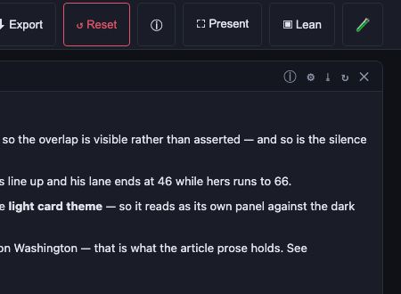

# Getting a board — or one widget — out of WikiBento (ISSUE-77)

**What shipped 2026-09-14:** one **⤓ Export** menu on every widget with four items — **PDF, CSV, PNG,
SVG** — and **🖨 Print / save as PDF** on the board toolbar for the whole board.

The menu replaced two buttons (`⤓` and `🖨`) before they became four: the action row is already ⓘ ⚙ ↻ ✕.
Availability is decided **when the menu opens**, from the live DOM — the only place the answer exists — and
a disabled item carries the reason in its tooltip rather than failing after the click.

## "Export" means four different things

They have very different costs, and the cheapest ones turned out to be the most useful:

| format | cost | fidelity | what it is for |
|---|---|---|---|
| **CSV / JSON data** | low | exact | the numbers behind a card, to reuse in a spreadsheet or a script |
| **PDF** | low | vector text, selectable | a page to file, print or send — via the browser's own print engine |
| **SVG** | low *where the widget is already SVG* | perfect | vector for print or a slide; the QR widget has done this since ISSUE-65 |
| **PNG** | medium–high | pixels | a picture for chat or a slide deck — for widgets that draw their own SVG, **and** for any widget whose image host sends CORS (ISSUE-80) |

The two shipped formats need **no dependency, no server and no canvas**. That matters here: WikiBento runs
on six small runtime packages, and a DOM-to-canvas library is a much bigger commitment than it looks
(below).

## Data: the ⤓ button

Every widget already holds its payload, so the work is a *mapping*, not a rendering problem:
`src/lib/exportData.js` turns the shapes the app actually produces — 2-D tables, rows of objects, chart
series, gallery items, a stat, and a **timeline** — into `{ columns, rows }`, and `toCsv` writes them out
with RFC 4180 quoting. The filename is derived from the widget type and its title
(`wikibento-sparql-born-1929-anne-frank-and-martin-luther-king-jr-2026-09-14.csv`).

Three rules, in the tests:

- **Export the data, not the pixels.** A screenshot of a chart is a picture of numbers.
- **Never invent a value.** A cell the widget does not hold is left empty, and a year-precision date stays
  `1964` — writing `1964-01` would assert a month the source never claimed.
- **No dead buttons.** The ⤓ button only appears when the payload actually has rows (a markdown card does
  not, so it offers print only).

The timeline is the interesting case because it genuinely exports something the query did not name: one row
per event with `lane, date, precision, kind, event, age`, including the age in each lane, which is the
column an aligned comparison is really about.

## PDF: the 🖨 button

The browser's print engine is the highest-fidelity PDF path that exists, and it is free: real vector text,
selectable and searchable, correct page geometry. Two print modes, both driven by `data-print` on `<body>`:

- **`data-print="widget"`** — every other card and all editing chrome is hidden; the card fills the page.
- **`data-print="board"`** — the whole board, reproducing the on-screen grid: the same columns, the same rows
  side by side, in reading order.

**The board sheet reproduces the grid (revised 2026-09-18).** It used to make every card full width and stack it in
DOM order, which is neither the board's arrangement nor its reading order. Measured on `anne-frank-mlk-demo`, that
turned a symmetric row (`excerpt w4 · views w2 · views w2 · excerpt w4`) into four stacked pages, split two
side-by-side galleries across pages, and printed the note that *opens* the board fifth. Now `boardPrintGeometry`
(`src/lib/print.js`) derives a slot per card from the live layout — column, span, and a **shelf** row, where items
whose vertical spans overlap share a line — and the sheet lays out the same 12-column grid on paper. The same board
prints in the same order, as two pages instead of seven, and a card authored outside the grid is trimmed to fit
rather than pushed off the paper.

Two related fixes came with it: the sheet is armed for **any** print, not just the 🖨 button (a `beforeprint`
listener, so ⌘P and the browser's own Print… menu get the board instead of react-grid-layout's clipped transforms),
and the three-second disarm timer is **gone** — it fired mid-print on a slow job, clearing the slots and producing
a PDF with the layout this all exists to fix. `afterprint` plus a re-arming `beforeprint` needs no timer.

### Three shapes, because a dashboard is not a document (2026-09-18, second pass)

The 🖨 toolbar button is a menu. Reproducing the board's grid fixed the flow; the *first* attempt at it grouped cards
into "shelves" by overlapping vertical spans, which is right for a tidy board and **wrong for a staggered mosaic** —
on the Met demo a tall card's column is re-used by the card below it, five cards landed in one shelf, two pairs shared
a column, and page two printed four cards over each other. Placement now comes from the layout's own `x`/`w`/`y`/`h`,
so **CSS grid cannot overlap two cards** — the invariant the sweep now checks on every demo in every engine.

| in the menu | what you get | Met demo | Anne Frank demo |
|---|---|---|---|
| 🧩 **Board** | the board's own grid: same rows, same columns, cards never split | 11 pages, no overlap | 6 pages |
| 🖼 **Poster** | **one page, sized to the board** (`@page size` from the board's box) — the whole thing at its own aspect, cards clipped exactly as on screen; the dialogue's "scale to fit" turns it into whatever paper you have | **1 page** | **1 page** |
| 📄 **Document** | one card per row, full width, in (row, column) order — the shape to *read*, with the most predictable page count | 21 pages | 4 pages |

### Printing a live dashboard is a race, and a reflow is the wrong answer (2026-09-18, third pass)

Andrew, whose Met-board PDFs still showed overlaps in Board and Document and missing gallery images in Poster:
*"is there an issue with some images not loading, given the timing … do you have any plan? … can we make the text run
better and not overlap?"* Two mechanisms, both now in place.

**1. Wait for the board to settle.** `window.print()` snapshots whatever is on screen at that instant; stats APIs and
galleries resolve over seconds, so the sheet could be taken from a half-loaded board — the poster's grid of images
that had simply not arrived, and geometry computed from content that was still growing. `preparePrint()` now waits for
every image to decode and for no card to be in a loading state (20s timeout, a visible *"Preparing the print — 42 of
139 images…"* note, because silently stalling a print would be worse than a missing image), and only then asks for
the sheet.

**2. Scale to the paper; never reflow it.** Board and Document used to let the paper's width decide the cards' width,
and everything measured for the screen — a gallery's fixed tile grid, a wide table, a chart's absolute labels —
overflowed the narrower column and painted over its neighbour. That is the reported overlap, and it is *horizontal*,
which is why two card boxes never touched and the first print check reported "0 overlaps" while the PDF had four
cards on top of each other. A dashboard is a drawing, not a document: on paper it should be shrunk, not re-laid-out.
`zoom: var(--print-zoom)` takes the board's own width to A4's content width — `zoom`, not `transform: scale()`, because
it changes the layout size so pagination stays correct — and the page size is left to the dialogue, so any paper
works.

**3. In Document mode, let a document flow.** `break-inside: avoid` is right for the board (a card is a picture) and
wrong for a document: a tall card jumped to a fresh page and left the rest of the previous one empty — measured, a
page holding a card header, one line of text and nothing else. Cards may split there now, which took the Met board
from 21 pages to 11 to **8**. The trade-off, stated plainly: a tall chart can be cut by a page boundary.

**And the check that let this through is fixed too.** The sweep's print pass measured 300ms after arming, when every
card was short and nothing collided; it now waits for the same settled state a real print gets, and it checks two
things — that no two cards touch, and that nothing inside a card (`.gallery-grid`, `.ranking-rows`, `table`,
`.glam-card`, `.excerpt-card`) paints outside its own box. A print check that does not wait is a check that lies.

Two things the poster taught, both only visible by looking at the output: card heights come from the screen, so the
page needs an **allowance** — script cannot measure the printed layout, because `beforeprint` runs while the page is
still in screen media (a poster page a little taller than its content is still one page, and scale-to-fit handles the
rest) — and every image has to be **loaded before the sheet is taken**: the Met gallery printed as a grid of empty
black tiles because cards below the fold use `loading="lazy"` and had never been fetched, so arming now flips them to
eager (139/139 loaded, verified).

What is deliberately kept on paper: the widget's own header (it names the card), and the ⏱ freshness
footer — a printed chart with no "as of" line is a claim without a date. What is hidden: the toolbar,
the action buttons, the instance-id chip, the resize grips.

The mechanism is small enough to read in one sitting (`src/lib/print.js`), and it exists because
react-grid-layout positions cards **absolutely with transforms** while `.grid-item` clips its overflow.
Printed as-is that is a cropped, overlapping mess; the print sheet neutralises the grid completely
(`position: static`, no transforms, auto height).

## SVG and PNG: what is possible, measured

**Measured 2026-09-14 — and it changes the plan.** The approach was to clone the widget, inline every
computed style, wrap it in an SVG `<foreignObject>` and rasterise that. The wrapper produces a **valid
.svg**, but the rasterisation is impossible in Chromium:

| document drawn into a canvas | `toBlob` result |
|---|---|
| plain SVG (no `foreignObject`) | ✅ works |
| `foreignObject` containing *only* `
hello
` | ❌ `SecurityError: Tainted canvas` |
| `foreignObject` + a remote `` | ❌ tainted |
| `foreignObject` + a `data:` URI image | ❌ tainted |

A bare `
` taints it: **Chromium refuses to hand back any canvas drawn from an SVG containing a
`foreignObject`**, so no amount of inlining helps. Hence the honest capability matrix, which the menu
enforces:

| widget draws itself as… | PDF | CSV | SVG | PNG |
|---|---|---|---|---|
| **HTML/CSS** (timeline, tables, ranked lists, galleries — most of the app) | ✅ | rows? | ✅ *file opens in a browser* | ❌ needs a screenshot |
| **HTML/CSS with a CORS image** (IA Book's IIIF pages, and anything else on `iiif.archive.org`, `upload.wikimedia.org`, `thumb.wikimedia.org`) | ✅ | rows? | ✅ | ✅ **built 2026-09-15** — the image is reloaded with `crossOrigin` and drawn, so the canvas stays clean and the PNG is real |

*The host list is measured, not guessed (`CORS_IMAGE_HOSTS` in `src/lib/exportImage.js`): each entry was
verified to send `Access-Control-Allow-Origin`. `archive.org` is deliberately absent — its `/download/` and
`services/img` send no CORS, so those images stay display-only.*
| **SVG** (CIM trend, file traffic, QR) | ✅ | rows? | ✅ | ✅ rasterised at 2× |
| **iframe** (wiki page, 360° panorama, video) | ✅ | – | ❌ | ❌ |

Only four widgets on the 40-widget showcase board draw SVG (two CIM charts, the QR, and one iframe) — the
app's own charts are mostly CSS, which is why this matters more than it sounds.

**So pixel-perfect PNG of an arbitrary HTML widget is a decision, not a detail** — unless the widget's
pixels come from an image host that allows CORS, which is the case ISSUE-80 closed. Two honest routes for
the rest:

1. **A DOM-to-canvas library** (`html2canvas`, `modern-screenshot`): they draw each element with canvas
   primitives instead of a `foreignObject`, which is why they avoid the taint — and why they re-implement
   CSS. It is a new runtime dependency for a project that has six.
2. **A server-side render** — the Playwright that already records the tutorial videos screenshots the
   widget element in a real browser, with no CSS-fidelity risk, and can emit a print-quality PDF too. That
   is a service to run (a browser per request, caching by config hash, rate limiting), which is why it is
   its own issue rather than a button.

Until then the menu is truthful about it, and print-to-PDF covers most of what a PNG gets wanted for.

**Decided 2026-09-14: this will not be a server-side feature.** The reasoning is recorded in
[ISSUES.md](ISSUES.md) ISSUE-79 and comes down to four costs — it re-fetches the whole board for one image
(the pipeline's own recordings show **17.7–18.1 s of lead-in** per board), the traffic lands on Wikimedia
APIs from a shared Toolforge IP, Chromium is 300–500 MB against a **1 Gi** pod and parses untrusted content
(our widgets can embed arbitrary external pages), and it is a permanent patching/monitoring liability — plus
the objection that survives all of those: a server render is a **re-render, not a capture**, so it cannot
show the user's zoom, scroll, theme or params anyway.

**Getting a PNG anyway, without a service:**

| you want | do this |
|---|---|
| a picture of a card, or of the board | screenshot your own device — the browser has the pixels and the right DPR |
| a **file** of a card | **SVG** from the ⤓ menu, then convert locally (any browser, Figma, Illustrator, `rsvg-convert`) |
| a card that draws itself as SVG (charts, QR), or whose image host sends CORS (a book page) | **PNG** from the ⤓ menu — rasterised exactly, at 2× |
| something for a report, a slide or an email | **PDF** from the ⤓ menu — vector and selectable, better than a PNG for all three |

If PNG-of-any-widget is ever genuinely needed, the proportionate next step is a **client-side** DOM→canvas
library (one dependency, no server), or **scheduled snapshots** of a curated board list for the archival
case — never a per-request render endpoint.

## The original PNG reasoning, kept for the record

A picture of a widget is the one export that cannot be done well from inside the page without a
dependency, and even with one it is the least trustworthy:

1. **DOM → canvas libraries** (`html2canvas`, `modern-screenshot`) re-implement CSS. This app uses
   `color-mix()`, CSS variables, container queries and `position: sticky`; the first two alone are where
   these libraries fail quietly — you get a file, just a wrong one.
2. **The SVG `foreignObject` route** (serialize the DOM into an SVG, draw it to a canvas) has full
   fidelity but requires inlining every image as a data URI and every font, and it cannot capture an
   **iframe** at all — so the Wiki Page, 360° panorama and video widgets would export as blank boxes.
3. **A server-side render** is the honest answer: the same Playwright that records the tutorial videos
   (see `pipeline/`) screenshots the widget element in a real browser, with no CSS-fidelity risk, and can
   also emit a proper print PDF with `page.pdf()`. That is a genuine service though — a browser per
   request, caching by config hash, rate limiting — and it belongs in its own issue rather than bolted on.

So PNG waits. Print-to-PDF already gives most of what people want a PNG for, and it works today.

## Traps found while building this (each was invisible to the test suite)

- **A region rewrite deleted a component that the registry still named.** `BarCard` was removed when the
  timeline card was rewritten (commit `e4cdad8`) while `sparql`'s registry entry still pointed at it, so
  every bar-rendered SPARQL query threw `ReferenceError: BarCard is not defined` for three commits —
  caught by the widget ErrorBoundary and shown as "💥 Try Again", with a green suite behind it. Nothing
  had ever compared the registry to the components; `tests/renderer-registry.test.mjs` now does, for both
  the registry and the dispatcher switch.

- **Inserting a helper above a component's `function` line can steal its `export default`.** The CSV helper
  landed between `export default` and `function WidgetFrame(`, so the module's default export became the
  helper: App rendered `saveCsv(props)` — a boolean — for every card. No exception, no error boundary, no
  console output, a clean build, and **no widgets on the page**. A source-level test now pins the export.
- **A flattened test fixture hid the real nesting.** The timeline's lanes are at
  `payload.timeline.lanes`, not `payload.lanes`; a fixture written from memory exported the raw query rows
  instead of the events and still passed. Fixtures must be copied from what the transform really returns.
- **A guessed CSS class hides nothing.** The print sheet hid `.toolbar`, which does not exist
  (`.app-header` does), so the first PDF-shaped page printed the toolbar across the top.
