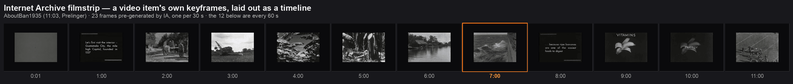

# Internet Archive — the widget family: what exists, what the API gives, what it costs

*Researched 2026-09-15 by probing the live APIs and reading the official pages. Every number in
the tables below was measured on that date unless the row says otherwise; the four probes are
reproducible with `curl` and a descriptive User-Agent.*

Today WikiBento reaches the Internet Archive for exactly one thing — **web snapshots**
(`waybackGallery`) — plus one item-level card (`iaItem`). This page is the plan for the rest of it:
**texts, audio, video, images, TV news**, the derivative files each of those actually ships, the
quotas we have to live inside, and the widgets I would build in what order.

## Where this stands

| | |
|---|---|
| **Shipped** | **`iaBook`** (2026-09-15 — a IIIF page viewer with search-inside, in the showcase catalog) · `waybackGallery` (closest capture per date, replay tiles, CDX fallback through `/api/proxy`) — see [WAYBACK-REPLAY-LATENCY.md](WAYBACK-REPLAY-LATENCY.md); `iaItem` (metadata + engagement views + thumbnail, `docs/DATA-SOURCES.md` §27) |
| **Planned, not built** | ISSUE-25 items 2–4: item views over time, IA search, IA collection |
| **The gap** | **media.** Nothing shows a book, an audio track, a film, a keyframe strip, a caption hit |
| **This page** | the verified API surface, the per-media-type file conventions, the quotas, and a ranked proposal |
## Playing the media — measured 2026-09-15

**Yes, and it works today.** The player widget streams video and audio through `<video>`/`<audio>`, and it
now accepts a **direct media URL** as well as a Commons `File:` name: a URL becomes a playable row with
**no API call at all**, because the URL *is* the media. Verified in Chromium against the live archive:

| check | result |
|---|---|
| `archive.org/download/…/AboutBan1935.mp4` in a card | **played** — `duration 664s`, `currentTime → 1.37s`, `paused: false` |
| three LibriVox chapters as a playlist | **played** — `duration 507s`, `currentTime → 1.54s`, "3 files" in the card |
| Range requests | `206` + `content-range: bytes 0-1023/68512128` — so **seeking works** |
| content types | mp4 → `video/mp4` (ftyp/isom) · ogv → `video/ogg` (OggS) · mp3 → `audio/mpeg` (ID3) · ogg → `application/ogg` |

**The codec caveat, measured rather than assumed:** Chromium 2026-09-15 answers
`canPlayType('video/mp4; codecs="avc1.42E01E, mp4a.40.2"') = "probably"` but
`canPlayType('video/ogg; codecs="theora, vorbis"') = ""` — and an `.ogv` element that loaded (664 s) reported
`videoWidth 0`, i.e. audio without picture. So **prefer the `.mp4` derivative**, pass the MIME type to
`<source>` so the browser can skip what it cannot decode, and treat `.ogv` as the fallback for engines
without proprietary codecs rather than the first choice. Audio is easy: `audio/mpeg`, `audio/ogg` and
`audio/flac` are all supported.

**What this does *not* give you** (which is what the remaining cards add): the file list comes from **you**,
not from the item — so no automatic multi-track playlists, no per-part titles and durations, no keyframe
strip, no spectrograms. `iaPlaylist` / `iaVideo` / `iaAudio` are still the plan; the player simply proves
the playback layer is not the risk.

| **Shared with** | the paged viewer is being extracted from `iaBook` so a **Commons PDF/DjVu** reader can reuse it — see [DOCUMENT-VIEWER.md](DOCUMENT-VIEWER.md) (ISSUE-82), which also means facing pages (ISSUE-81) is built once for both |
| **See it** | [`?config=/internet-archive-demo.json`](https://wikibento.toolforge.org/?config=/internet-archive-demo.json) — the demo board: two books (16 and 304 pages) and four archive items, verified by rendering (12 assertions). Linked from the hub (`demos.json`) and the README |

The whole family is attractive because the API is unusually friendly: **most of it is CORS-enabled
and needs no key**, the URLs are stable and human-readable, and the media files stream straight into
`<video>`/`<audio>`/`` without any of it passing through our servers.

## The API surface — verified 2026-09-15

| endpoint | gives | CORS | measured |
|---|---|---|---|
| `archive.org/metadata/{id}` | full item metadata + every file, with sizes | ✅ `*` | 0.34–1.80 s · 2.2–50 KB (an 87-file concert: 30 KB) |
| `archive.org/metadata/{id}/files?start&count` | paged file list | ✅ | (ISSUE-25) |
| `archive.org/advancedsearch.php?q&fl[]&rows&page&sort&output=json` | metadata search | ✅ `*` | 0.34–1.94 s · `rows=10000` → 392 KB |
| `archive.org/services/search/v1/scrape?q&fields&size&cursor&total_only` | cursor paging, deep results, cheap counts | ✅ `*` | `total_only=true` → **37 bytes** |
| `be-api.us.archive.org/views/v1/short/{id}` | engagement (all-time / 30 d / 7 d) | ✅ | (ISSUE-25) · detail series: **5.8 s / 48 KB** |
| `iiif.archive.org/iiif/{id}/manifest.json` | IIIF **v3** manifest: canvases, labels, annotation lists | ✅ (origin echoed) | 1.0 s · 25.7 KB |
| `iiif.archive.org/iiif/{id}${leaf}/full/{w},/0/default.jpg` | **any page of any book**, any size/crop/rotation | ✅ | 1.8 s · 57 KB at `w=400` |
| `archive.org/download/{id}/page/n{N}.jpg` (+ `_w800`) | a leaf as one JPEG | ❌ none | 2.7 s · 864 KB full, 319 KB at `_w800` |
| `archive.org/download/{id}/{file}` | the actual media + derivatives (ranged requests) | ❌ (not needed — see below) | — |
| `archive.org/download/{id}/{id}_djvu.txt` | OCR text for a scanned item | ✅ `*` | 302 → file |
| `archive.org/services/img/{id}` | item thumbnail | ❌ | 302 → 22.6 KB JPEG |
| `api.gdeltproject.org/api/v2/tv/tv?query&mode&format` | TV caption clips (GDELT, no key) | ✅ `*` | **11.5 s** — too slow to leave uncached |
| `archive.org/details/tv?q&fq=channel&time&rows&output=json` | TV News Archive caption search | ❌ **and didn't return JSON to a plain client** | proxy-gated |
| `iiif.archive.org/iiif/search/{id}/?q=word` | **search inside one book**: hits with page + the matched word's box | ✅ | `q=goody` → **22 hits** |
| `iiif.archive.org/iiif/3/annotations/{id}/{id}_djvu.xml/{leaf}.json` | one page's OCR text | ✅ | 200 · 1.1 KB |
| `ia-fts.archive.org` (corpus full-text search) | OCR full-text across the archive | — | **did not resolve from this network** — no longer a blocker for books: the per-book route above works in a browser |
| `web.archive.org/cdx/search/cdx` · `/web/timemap/link/` | capture index, memento timeline | ❌ | (ISSUE-25: 503-prone; timemap **27 MB** per call) |

**Two different kinds of "no CORS", and the difference matters:**

1. **Display-only** (`services/img`, `download/.../page/n{N}.jpg`): fine as ``, but
   **not** readable as data — no `fetch()`, and drawing one on a canvas **taints it**. So those
   widgets can be screenshotted by the user but cannot offer PNG/SVG export.
2. **Media** (`download/{id}/*.mp4|mp3|ogg|flac`): CORS is irrelevant — `<video>` and `<audio>`
   load these directly, with range requests and the browser's own streaming, and nothing transits
   our origin. This is the single most important design fact in this document: **the media widgets
   are cheap**, because the bytes never touch us.

**IIIF is the unlock for books** — and, per IA's own documentation, "nearly all image, text, audio
and video items" have a IIIF URI, not just scans. Because the IIIF image endpoint sends CORS, page
images are also **canvas-safe**, which makes a book viewer one of the few widgets in WikiBento that
can honestly offer **PNG export** (see [EXPORT.md](EXPORT.md) for why that is otherwise rare).

## What each media type actually contains

Read off real items: `goodytwoshoes00newyiala` (scan, 20 leaves), `art_of_war_librivox` (audiobook),
`OtherBrothersFox4.8` (Live Music Archive concert), `AboutBan1935` (Prelinger film), a `tvarchive`
broadcast.

| type | the files that matter | notes for a widget |
|---|---|---|
| **texts (scan)** | `_jp2.zip`, `_djvu.xml`, `_djvu.txt`, `{id}.pdf`, `{id}_bw.pdf`, `.epub`, `chOCR`, `_scandata.xml`, `imagecount` | `imagecount` is the page count — a viewer needs no manifest fetch to know it. OCR text is a **0.02 MB** fetch: excerpts are nearly free |
| **texts (plain)** | `_djvu.txt`, `.txt`, `.epub`, `.zip` | Gutenberg-style items have **no pages to show** — no `imagecount`, IIIF 500s. The card must degrade to text/metadata |
| **audio (music)** | `*.flac` (master), `*.mp3` (VBR), `*_spectrogram.png`, `_esshigh.json.gz` / `_esslow.json.gz` (Essentia feature data) | per-track spectrograms are ready-made visuals; Essentia gives BPM/tuning/peaks if a richer card is ever wanted |
| **audio (spoken)** | `*.mp3` + `*_64kb.mp3`, `*.ogg`, `*_spectrogram.png`, plus **the scanned book**: `{id}.pdf`, `_djvu.txt`, `_jp2.zip` | audiobooks carry their text — a read-along card is possible |

*The filmstrip, drawn from real frames: `AboutBan1935` (11:03) ships 23 keyframes, one per 30 seconds
(`{id}.thumbs/{id}_000030.jpg` is the frame at **30 seconds** — the index is seconds, verified against the
11:03 runtime). The strip shows every 60 s; the boxed frame is the one under the playhead. A design mock:
the frames are the archive's, the layout is what `iaVideo` would paint. Density is IA's choice — a
50-minute course lecture gets only **4** frames per part (140 for 35 lectures), so a lecture strip is a
chapter strip, not a scrubber. And we cannot make our own: `download/` sends no CORS, so `<video
crossorigin>` fails and a canvas drawn from it is tainted.*

| **video** | `{id}.mp4` (h.264), `{id}.ogv`, `{id}.mpeg` (MPEG2), `{id}.gif`, `{id}.mp3`, **`{id}.thumbs/{id}_0000NN.jpg`** | the `.thumbs/` series is a **keyframe filmstrip** — ~1 frame per 30 s. That is a timeline of pictures, and it is free. A **course** item is this shape × 35: `ocw-18.01-f07-lecNN_300k.mp4` + `.ogv` + `.srt` + 4 keyframes each, with `length` and `title` on every file |
| **TV news** | `{id}.mp4`, `{id}.mpg`, 374 × `.thumbs/` keyframes, `.srt` on US network items, `.xml`, `.sqlite` | timestamps + captions make *clippable* cards; international items carry no `.srt` |

**Item sizes are large and must never be fetched into memory:** 888 MB (Prelinger film), 867 MB
(concert), 346 MB + 517 MB (one TV broadcast), 95 MB (a 20-page scan). Media stays a URL.

## Collection, item, or playlist? One call settles it

**The URL tells you nothing.** `archive.org/details/mit_ocw` (a collection holding **511** courses) and
`archive.org/details/MIT18.01JF07` (one course: **35 lectures**) look identical in a link. One
`metadata/{id}` call answers both questions, because the difference is a field, not a naming scheme:

| shape | the marker | measured example |
|---|---|---|
| **collection** — a bucket of items | `metadata.mediatype === 'collection'`; its own `files[]` are only Metadata / JPEG Thumb / Item Image / torrent, and `item_size` ≈ 0.1 MB | `mit_ocw`: 11 files, 0.1 MB, **511 children** |
| **item, one asset** — a film, a scan, a recording | a media `mediatype` (texts / audio / movies / image / …) whose playable files **collapse to one part** once derivative suffixes are stripped | `AboutBan1935`: the film in avi + mp4 + ogv + mpeg + its mp3 strip = **one** part (plus a one-file `_edit` variant) |
| **item, a playlist** — a course, a concert, an audiobook | same mediatypes, but the media files group into **2+ ordered parts, each with its own `length`** (and usually a `title`) | `MIT18.01JF07`: **35** lectures × (mp4 + ogv), all 70 files titled and timed · a Live Music Archive show: **20** tracks · LibriVox: **7** chapters |

Four rules fall out of that, all measured:

- **A collection's own metadata lists no children.** `mit_ocw`'s record is 4.7 KB of description and
  thumbnails; to enumerate its courses you must ask the search API —
  `services/search/v1/scrape?q=collection:mit_ocw&total_only=true` → `{"total": 511}` in **34 bytes**,
  then cursor paging for the actual list. This is the one distinction that breaks the naive design
  ("read the collection's metadata" returns nothing but a blurb).
- **Collections nest, and an item names its parents.** `MIT18.01JF07`'s `collection` field is
  `["mit_ocw", "culturalandacademicfilms"]`, and `mit_ocw` itself lives in `culturalandacademicfilms`
  and `movies`. Children are never named by the parent — the relation points upward only.
- **Derivative suffixes fool naive grouping.** One film ships as `X.mp4` + `X.ogv` + `X_512kb.mp4` +
  `X.mpeg` + `X.mp3`. Strip `_512kb | _300k | _64kb | _vbr | _spectrogram | __ia_thumb` (and drop
  `_spectrogram.png`, `.srt`, `.gif`, `.thumbs/`) *before* grouping, or a single Prelinger film reads
  as a playlist. My first heuristic did exactly that — it called `AboutBan1935` a 2-part playlist
  because of `AboutBan1935_edit`.
- **`length` and `title` per file are what make a playlist card good** — present on all 70 MIT files
  and all 20 concert tracks, absent on a single asset's container variants. Where they are missing,
  fall back to the filename stem and natural-sort it (`lec01 … lec35`, `01-Intro … 20-…`).

**Playlists are not a different object type.** There is no playlist entity in the IA API — a playlist
is an item whose `files[]` happen to be a series. So `iaPlaylist` (below) is a *renderer* over the
same metadata call `iaItem` already makes; the only new work is grouping, ordering and the player.

## Limits and quotas

| limit | number | source | how we comply |
|---|---|---|---|
| **Advanced Search deep paging** | the **10,000th** result is the last one reachable; beyond that an error | official: *"We limit the number of sorted paged results returnable to 10,000"*; verified: `rows=1&page=10000` → 200, `page=10001` → error | never page deep; use `scrape` for more |
| **Scrape `size`** | **min 100, max 10,000** (server-enforced) | verified: `size=99` → `400 count '99' is too small (min count=100)`; `size=20000` → `400 … max count=10000` | use `total_only=true` for counts (37 bytes), and one 10,000-item call instead of ten small ones |
| **IIIF** | the retired labs service documented *"unauthenticated requests will be limited to 2,000 per hour"*; the **current** official documentation states **no numeric limit** | iiif.archivelab.org/iiif/documentation (labs, historical) — the official iiif.archive.org page has no rate-limit section | treat 2,000/hour as the planning budget, cache page images by URL, and watch response headers for the real limit |
| **Everything else** | no published number; **no rate-limit headers observed** in a 6-request burst (all 200, ~0.45 s) | measurement | the general etiquette below is the whole policy |
| **Bots / automated access** | descriptive **User-Agent with tool name, version, and model for AI agents**; delays for bulk operations; **honour 429 + `Retry-After`**; limit concurrency (*"Limit to 4 concurrent downloads with 1 second delay"*); cache responses; prefer bulk endpoints; exponential backoff | archive.org/developers/bots.html | `$WIKIMEDIA_USER_AGENT`; the app's 4-concurrent HTTP layer with `Retry-After` as a global cool-down; a shared TTL cache per endpoint; research scripts paced ≥1 s |
| **Bandwidth** | not a quota, an etiquette: we are a guest | — | **never proxy media** through Toolforge; hand URLs to `<video>`/`<audio>`/`` and link the IA details page as the canonical copy |

**Two traps in the quota mechanics:**

- **Deep paging fails with HTTP 200 and an error body**: `[DEEP_PAGING] Requested results would
  exceed the deep paging limit`. A widget that only checks `res.ok` will parse an error as data. Any
  IA search widget must check for the `error` key before reading `response.docs`.
- **The scrape minimum is a 400, not a clamp.** `size=99` is rejected outright — a "give me 20
  results" call is invalid; ask for 100 and slice client-side.

## Proposed widgets

Ranked by (value × cheapness) ÷ risk. Sizes are rough: S ≈ an afternoon, M ≈ a day, L ≈ a week.

| # | widget | id | size | what it shows | data flow |
|---|---|---|---|---|---|
| 1 | **📖 IA Book** ✅ shipped 2026-09-15 (facing-pages view filed as ISSUE-81) | `iaBook` | M | a scanned book, page by page: turn, zoom, jump, with page N of `imagecount` and links out to PDF/EPUB/OCR | `metadata` (page count, derivative links) + IIIF `…${leaf}/full/{w},/0/default.jpg`. **CORS ✅, so the page is not canvas-tainted** — PNG export is possible here and needs a CORS-image path in `src/lib/exportImage.js`, which today offers PNG only for SVG-drawing widgets (ISSUE-80) |
| 2 | **🎞️ IA Playlist** | `iaPlaylist` | M | a course, concert or audiobook as an ordered list of parts — per-part duration and title, a total runtime, one part playing at a time | one `metadata` call, grouped by stem (rules above) → ordered tracks; `<video>`/`<audio>` streams them. MIT OCW additionally gives **SubRip captions per lecture**, so a transcript per part is nearly free |
| 3 | **🎬 IA Video** | `iaVideo` | M | `<video>` with poster + duration, and a **keyframe filmstrip** below it | `<video src=…mp4>` (browser-streamed, no CORS) + `{id}.thumbs/` series; `metadata` for `runtime` |
| 4 | **🎧 IA Audio** | `iaAudio` | M | one recording with inline playback and its spectrogram | `metadata` (mp3 / 64 kb / ogg / flac) + `<audio>` + `_spectrogram.png` |
| 5 | **🗂️ IA Collection** | `iaCollection` | M | a collection's holdings: child count, mediatype breakdown, top items | 1 × `scrape …&total_only=true` for the count (34 bytes) + per-mediatype counts + one `advancedsearch` for top items; **the collection's own metadata has no children** |
| 6 | **🔍 IA Search** | `iaSearch` | S–M | free-text search across the archive, with thumbnail, year, mediatype and download count | `advancedsearch` (≤10,000 reachable) + `services/img` thumbnails (display-only) |
| 7 | **📈 IA Item Views** | `iaViews` | S | an item's engagement over time (already item 2 of ISSUE-25) | `be-api…/views/v1/detail/item/{id}/{start}/{end}` — **5.8 s / 48 KB: cache hard, refresh rarely** |
| 8 | **🖼️ IA Images** | `iaImages` | S | an image-search gallery (posters, plates, photographs) | `advancedsearch` + `services/img`; **no export** (canvas-tainted) |
| 9 | **📺 IA TV News** | `iaTvNews` | M–L | caption hits with timestamps → clip cards that deep-link into the player | TVNA search is **proxy-gated and non-JSON**, and one broadcast is ~350 MB; **or** GDELT TV (CORS ✅ but 11.5 s). Rank it last, and cache it hard |

**Resolved on the way:** search-inside **does** work from a browser — not through the standalone FTS host
(which never resolved) but through each book's IIIF **Content Search** service, advertised in the manifest,
which returns the page number *and the bounding box of the matched word*. `iaBook` ships it. Only
*corpus-wide* full-text search remains unverified.

**Deferred, with reasons:** corpus-wide full-text search; software/emulation
(emularity in an iframe, a much bigger surface); Scholar/Fatcat (a separate catalogue); uploads and
the S3 API (credentials).

**The first three are the answer to "the full range of IA content":** a book, a film and a record —
and they are one pattern (metadata for the manifest of files, then let the browser stream or the
IIIF server render). They also give the board its first genuinely *visual* IA content: a page, a
keyframe strip, a spectrogram.

## Export implications

Worth designing in from the start, because IA splits cleanly:

| IA content | CSV | PDF | SVG | PNG |
|---|---|---|---|---|
| `iaBook`, `iaAudio`-with-IIIF, anything IIIF-served | ✅ page/leaf list | ✅ | ✅ | ✅ **canvas-safe**, but needs the CORS-image path (ISSUE-80) — today the menu offers SVG/PDF/CSV for it |
| `services/img` thumbnails, `download/.../page/nN.jpg` | ✅ | ✅ | ✅ | ❌ tainted — same rule as any widget that shows a cross-origin image |
| media players (`<video>`, `<audio>`) | ✅ track/file list from metadata | ✅ | — | — |

## Traps

1. **HTTP 200 with an error body** (deep paging). Check `error` before `response.docs`.
2. **`size=99` is a 400, not a clamp.** The scrape API's floor is 100.
3. **`services/img` and `download/page/nN.jpg` are display-only.** They work as `` and nowhere
   else — no `fetch`, no canvas, no export.
4. **A "book" is not always a scan.** Gutenberg-style items have text but no leaves; IIIF 500s and
   `imagecount` is absent. Detect before rendering a page-turner.
5. **Item sizes are hundreds of MB.** One TV `.mp4` is 346 MB. Never `fetch()` media; never proxy it.
6. **`iiif.archive.org/iiif/{id}/info.json` is not the reliable entry point** — it redirected to
   `/image/iiif/2/None/info.json` and 500'd/501'd on some items, while `manifest.json` (v3) and the
   `…${leaf}/full/…` image route worked first time. Use the manifest for structure, the image route
   for pixels.
7. **The old IIIF host is gone but its documentation lingers.** `iiif.archivelab.org` is the labs
   service; the production one is `iiif.archive.org` (official since Sept 2023) and speaks **v3**
   (`items`, language-mapped labels like `{'none': [...]}`), not v2 `sequences`.

## What I would build first

0. **Wire the CORS-image PNG path** (ISSUE-80) — `iaBook` is the first widget whose image host sends
   CORS, so `imageCapabilities` can honestly offer PNG for it; today it offers SVG/PDF/CSV because the
   only PNG path rasterises a widget's *own* SVG.
1. ~~**`iaBook`**~~ — **shipped 2026-09-15**: IIIF page viewer, page strip, search-inside with the matched
   word boxed on the page, per-page OCR text, PDF/EPUB/OCR links. **19 browser assertions pass**
   (`node scripts/ia-book-e2e.mjs`). Three traps became tests: the manifest's page count beats the
   metadata's (16 vs 20), leaf `$0` is a 500, and an out-of-range leaf answers 200 with a blank image.
2. **`iaPlaylist`** — MIT OpenCourseWare alone is 511 courses, every lecture titled, timed and
   captioned; a course player is the most *useful* card in the family, and the grouping rules are
   already written down above. It also covers concerts and audiobooks with the same code.
3. **`iaVideo` + keyframe filmstrip** — the most visually surprising card, and the filmstrip is a
   natural sibling of the Lifeline timeline.
4. **`iaAudio`** — one recording with its spectrogram; the Live Music Archive is the demo.

Then the already-planned search/collection/views cards, then TV news last.

**Decided:** they belong on one board — `?config=/internet-archive-demo.json` exists as of 2026-09-15,
with both built cards on it and one IA Item card per media type that the next three will render (a film,
a concert, an audiobook, a course collection). It grows a card per widget rather than changing shape.
