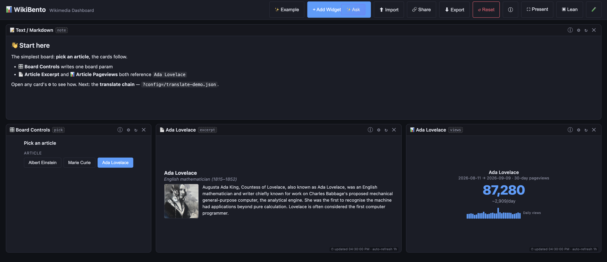
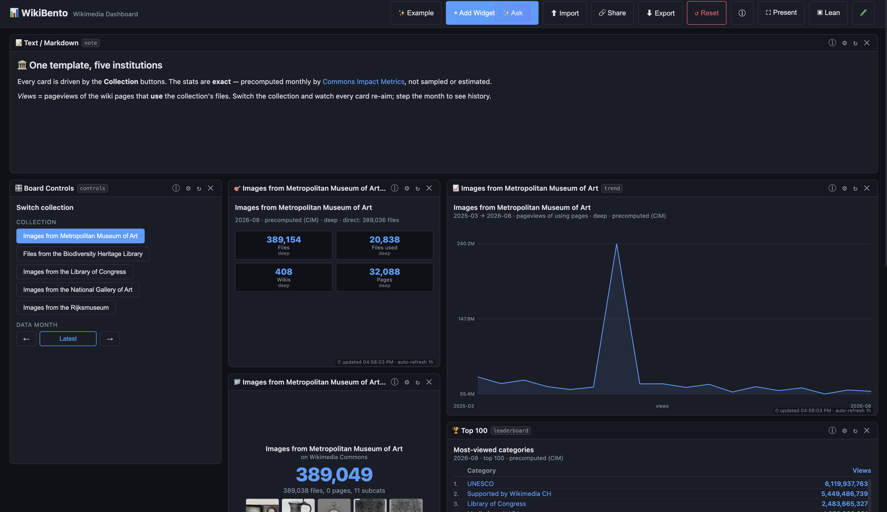
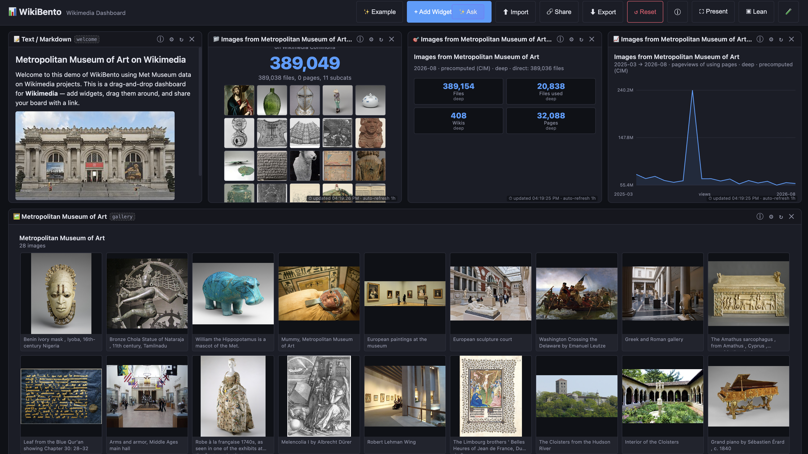
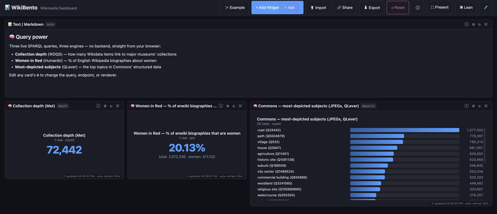
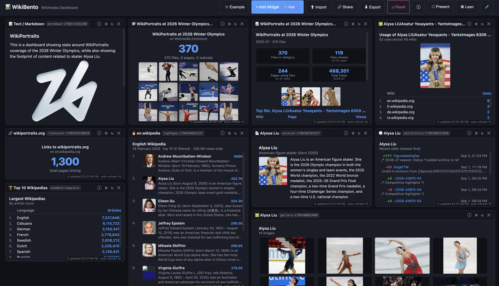

# Screenshots

Dated snapshots of real boards, kept as documentation of what the app looks like and
of the states that were verified. **These are snapshots, not current-state claims** —
numbers drift and widgets change, so treat the figures as "what it looked like then"
and check the live board for today's values. (Two things have changed since these were
taken, both noted below: the glam demo's collection control and its leaderboard scope.)

All captured **2026-09-10** from a desktop browser at ~3350 px wide.

---

## `interaction.png` — the simplest board: one param, the cards follow

The **article switcher** demo (`?config=/article-switcher-demo.json`): a welcome card, a
🎛️ Board Controls card with three article buttons (**Ada Lovelace** selected), and the two
cards that reference `{{article}}` — 📄 Article Excerpt and 📊 Article Pageviews
(87,280 views over 2026-08-11 → 2026-09-09, ~2,909/day, with the daily sparkline and its
labelled axis).

Demonstrates the interactivity primitive: one control writes one board param and every
referencing card re-aims.

## `interaction-glam.png` — the flagship: one template, five institutions

The **GLAM demo** (`?config=/glam-demo.json`) with the Metropolitan Museum of Art selected:
the Switch-collection control, the CIM snapshot (389,154 files deep · 20,838 used ·
408 wikis · 32,088 pages), the CIM views-over-time chart with labelled axes
(2025-03 → 2026-08), the top-files card (389,049) and the global Top-100 leaderboard.

> ⚠️ Superseded in two visible ways since capture: the collection control is now a
> **validated lookup box** (free text checked against the Commons Impact Metrics allow
> list) rather than buttons, and the leaderboard runs with `scope: shallow`, so its first
> row is no longer UNESCO — see ISSUE-68 and `docs/DATA-SOURCES.md` §19.

## `metmuseum-dashboard.png` — a subject board built from CIM + a category gallery

A Metropolitan Museum of Art board: welcome card, top-files grid (389,038 files,
11 subcats), CIM snapshot and trend, and an 🖼️ Article Gallery for the Wikipedia article
*Metropolitan Museum of Art* — 28 captioned images (Benin ivory mask, William the
Hippopotamus, *Washington Crossing the Delaware*, the Amethus sarcophagus, …).

Demonstrates the gallery's captioned-only default and the CIM family working off one
category.

## `sparql.png` — three SPARQL engines, three result shapes

The **query power** demo (`?config=/sparql-demo.json`): Collection depth (Met) = 72,442 via
**WDQS**, Women in Red = 20.13% (2,072,236 biographies · 417,132 women) via **Humaniki**,
and Commons most-depicted subjects on **QLever** as a 25-row bar chart with entity cells
rendered as **`Label (QID)`** — the label resolution that QLever cannot do itself.

## `wikiportraits-alysa-liu.png` — a real GLAM board, twelve cards

The WikiPortraits board (the README's example link, `?config=https://w.wiki/TR9R`):
a welcome card, the *WikiPortraits at 2026 Winter Olympics* category (370 files) with a
photo grid, GLAM impact stats for 2026-07 (370 files · 119 viewed of 131 used · 244 pages
on 47 wikis · 468,301 views) with the top-file filmstrip, a file-usage breakdown
(52 uses across 40 wikis), an external-link count, Top 10 Wikipedias, Top Wikipedia
articles for 19 February 2026 (with thumbnails and extracts), plus the Alysa Liu excerpt,
edit history and a 14-image gallery.

The best single illustration of the thesis: one board mixing category metrics, file usage,
rankings, article text and history — every number live from a Wikimedia API.

---

**Maintenance:** these are full-resolution PNGs (~8.5 MB total). If repository size
matters, `pngquant --quality=70-90` typically cuts screenshots by ~70% with no visible
difference; keep the originals if the exact pixels matter. Add new shots with the same
`wikibento-<date>-<subject>.png` naming and a section here.
