# Screenshots

Dated snapshots of real boards, kept as documentation of what the app looks like and
of the states that were verified. **These are snapshots, not current-state claims** —
numbers drift and widgets change, so treat the figures as "what it looked like then"
and check the live board for today's values. (Two things have changed since these were
taken, both noted below: the glam demo's collection control and its leaderboard scope.)

All captured from a desktop browser at ~3350 px wide — **2026-09-10** except the timeline below
(**2026-09-12**, 1500 px wide).

---

## `wikibento-2026-09-24-pick-wiki-page.png` — a pick that used to be refused (ISSUE-118)

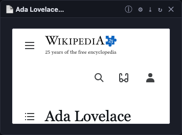

Armed **Wiki Page**, clicked *Ada Lovelace* in an article list: the card the click placed renders the real Wikipedia
page. Until 2026-09-24 this was refused — *"Wiki Page does not take a article"* — because the kind gate compared
`article` and `page` as labels, when `paramSources.js` defines the first as the main namespace and the second as the
wider set containing it.

## `wikibento-2026-09-24-pick-mode-menu.png` — the pick menu (ISSUE-114)

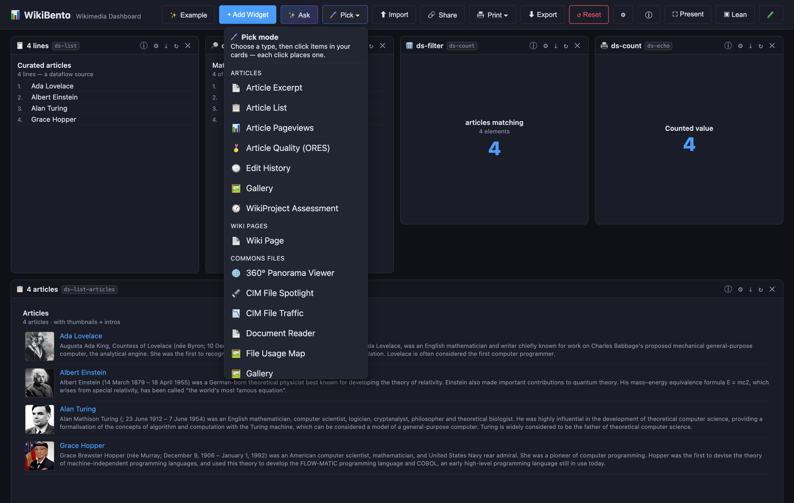

🖌 **Pick ▾** in the header lists the 19 widget types that consume something, grouped by *what* they consume —
Articles, Wiki pages, Commons files, Categories, Gallery pages. **+ Add Widget** sits beside it and is unchanged:
this is a second, power-user verb, not a replacement for it.

## `wikibento-2026-09-24-pick-mode-armed.png` — armed: what can be picked says so

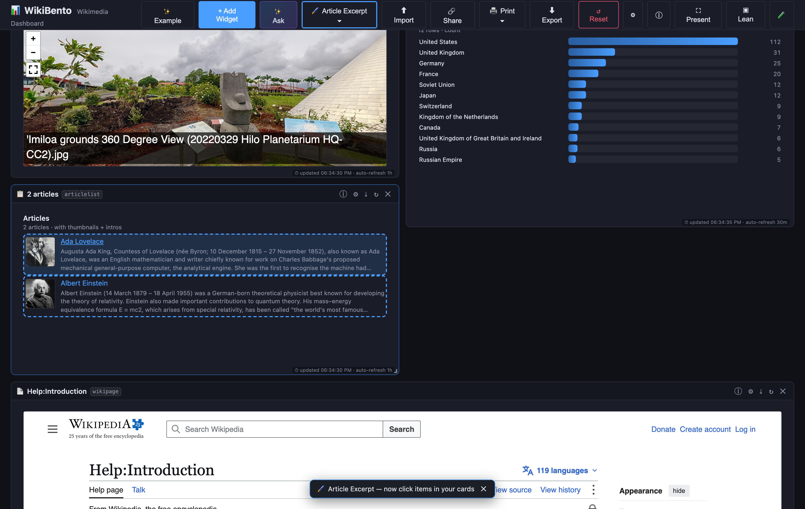

Once a type is chosen the button reads the armed type (`🖌 Article Excerpt ▾`), everything pickable takes a dashed
outline and the cursor becomes a crosshair — here article-list rows; ranked article rows, ranking rows whose own link
is an article or a file, GLAM sample strips, CIM file rows and gallery tiles look the same. Measured rather than eyeballed — an article row computes
`outline: none 3px; cursor: pointer` before arming and `outline: dashed 2px; cursor: crosshair` after.

## `wikibento-2026-09-24-pick-mode-spawned.png` — one click, one card, named in the toast

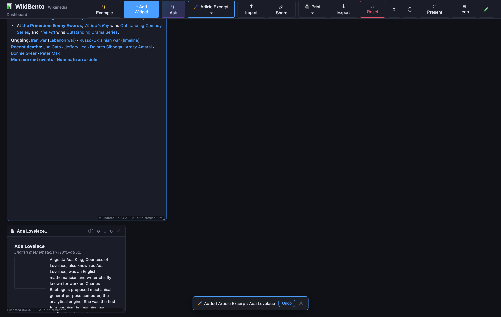

The click placed an **Article Excerpt** card for the item that was clicked (*Ada Lovelace*), said so in the toast, and
offered **Undo**. The brush stays armed, so the next click places the next card.

## `wikibento-2026-09-12-two-lives.png` — a timeline of two lives (ISSUE-78, v0)

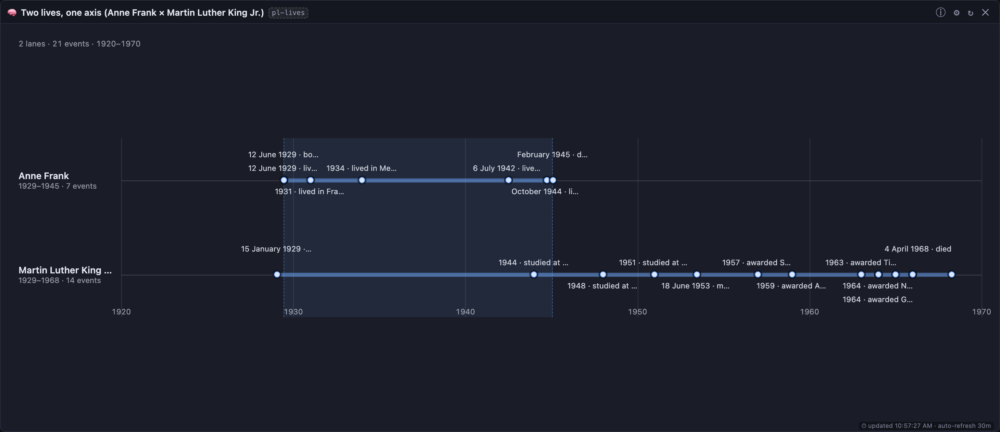

The `timeline` renderer on the SPARQL widget, calendar alignment, from the `two-lives` preset
(`?config=/parallel-lives-demo.json`). **Anne Frank** (1929–1945) and **Martin Luther King Jr.**
(1929–1968) on one shared axis: the lane bars start at the same point, hers ends at 16 while his runs
23 years further, and the shaded band is the window in which *both* are documented — 1929 to 1945,
which is her entire documented life. Every event is a structured Wikidata statement, so the lane
labelled "14 events" against hers at "7" is also a picture of what structured data holds (birth,
education, awards, residences) and does not hold (the diary, the arrest, Birmingham, Selma). See
[LIFELINE-WIDGET.md](LIFELINE-WIDGET.md).

## `wikibento-2026-09-14-print-widget.png` — one widget as a printed page (ISSUE-77)

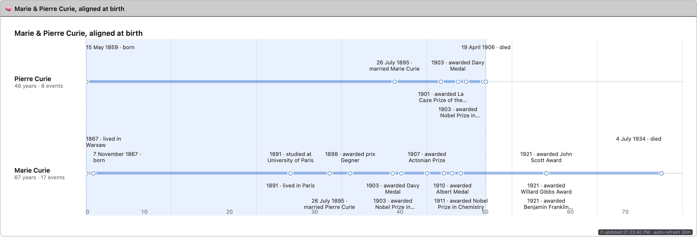

The 🖨 button under print media: every other card and all editing chrome is gone, the grid's transforms are
neutralised (printed as-is, the absolutely-positioned cards come out cropped and overlapping), and the
timeline is laid out as a document. The widget header and the ⏱ freshness footer deliberately survive — a
printed chart with no "as of" line is a claim without a date. See [EXPORT.md](EXPORT.md).

## `wikibento-2026-09-12-two-lives-light.png` — the light card theme (ISSUE-78)

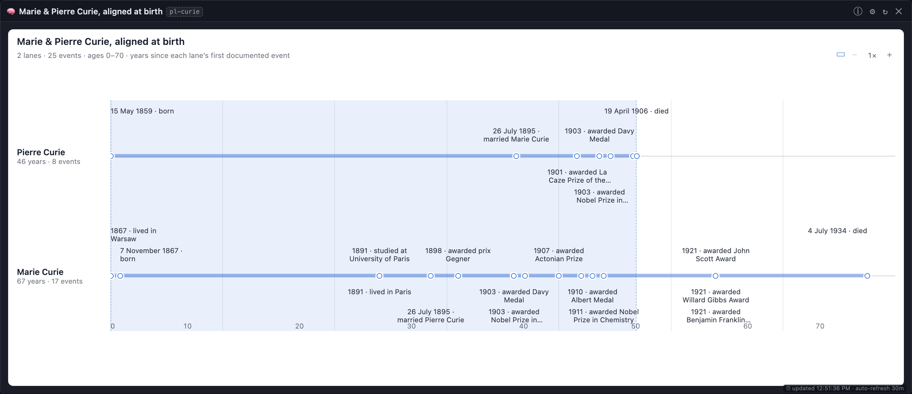

The same renderer with **Card background → Light**: an inset white panel that sets the timeline apart from
the dark board, with the whole palette inverted (ink, axis, spans, dot rings, the overlap band and the
sticky lane-name column) rather than dark colours left on white. The card also carries its own **title**,
which is what shows in presentation/lean mode, where the widget's title bar is hidden. The ▭ button beside
the zoom controls toggles the shaded overlap window.

## `wikibento-2026-09-12-two-lives-zoom.png` — zoomed to 8× (ISSUE-78)

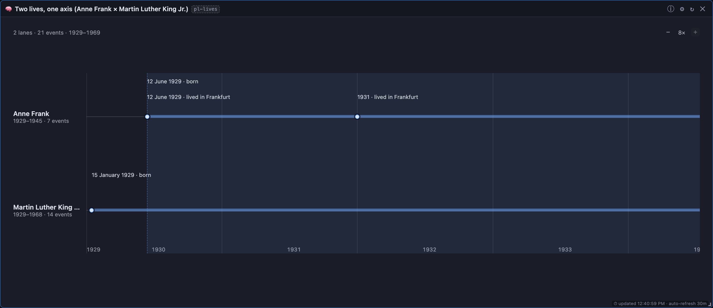

The same Anne Frank × MLK board with the axis stretched 8×, scrolled to the beginning. This is what the
**− / + zoom** control is for: at fit, five of the eighteen labels were truncated ("1944 · lived in
Bergen-Belsen concentratio…"); at 2× **none** are, and at 8× every one of the 21 events is labelled and
legible — the two births now read as five months apart, and the axis has gone from decade ticks to yearly
ones. Lane names stay pinned while the axis scrolls.

## `wikibento-2026-09-12-two-lives-age.png` — the same renderer, age-aligned (ISSUE-78)

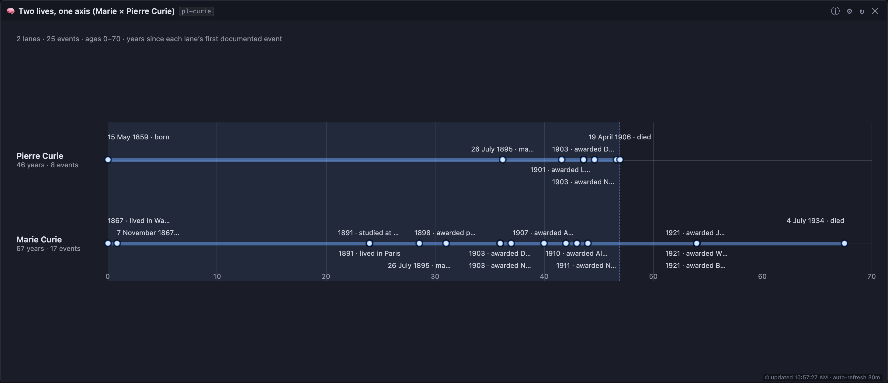

**Marie** (1867–1934) and **Pierre Curie** (1859–1906) — eight years apart at birth, which is what the
**age alignment** is for: every lane starts at 0, so their shared years line up (the marriage dot sits at
the same age on both) and the difference is legible at a glance — his lane ends at **46**, hers runs to
**67**. The shaded band is the window both are documented, which here is his entire life. The axis caption
says what it is measuring, because "age" means years since each lane's first documented event rather than
an assumed birth date.

---

## `interaction.png` — the simplest board: one param, the cards follow

The **article switcher** demo (`?config=/article-switcher-demo.json`): a welcome card, a
🎛️ Board Controls card with three article buttons (**Ada Lovelace** selected), and the two
cards that reference `{{article}}` — 📄 Article Excerpt and 📊 Article Pageviews
(87,280 views over 2026-08-11 → 2026-09-09, ~2,909/day, with the daily sparkline and its
labelled axis).

Demonstrates the interactivity primitive: one control writes one board param and every
referencing card re-aims.

## `interaction-glam.png` — the flagship: one template, five institutions

The **GLAM demo** (`?config=/glam-demo.json`) with the Metropolitan Museum of Art selected:
the Switch-collection control, the CIM snapshot (389,154 files deep · 20,838 used ·
408 wikis · 32,088 pages), the CIM views-over-time chart with labelled axes
(2025-03 → 2026-08), the top-files card (389,049) and the global Top-100 leaderboard.

> ⚠️ Superseded in two visible ways since capture: the collection control is now a
> **validated lookup box** (free text checked against the Commons Impact Metrics allow
> list) rather than buttons, and the leaderboard runs with `scope: shallow`, so its first
> row is no longer UNESCO — see ISSUE-68 and `docs/DATA-SOURCES.md` §19.

## `metmuseum-dashboard.png` — a subject board built from CIM + a category gallery

A Metropolitan Museum of Art board: welcome card, top-files grid (389,038 files,
11 subcats), CIM snapshot and trend, and an 🖼️ Article Gallery for the Wikipedia article
*Metropolitan Museum of Art* — 28 captioned images (Benin ivory mask, William the
Hippopotamus, *Washington Crossing the Delaware*, the Amethus sarcophagus, …).

Demonstrates the gallery's captioned-only default and the CIM family working off one
category.

## `sparql.png` — three SPARQL engines, three result shapes

The **query power** demo (`?config=/sparql-demo.json`): Collection depth (Met) = 72,442 via
**WDQS**, Women in Red = 20.13% (2,072,236 biographies · 417,132 women) via **Humaniki**,
and Commons most-depicted subjects on **QLever** as a 25-row bar chart with entity cells
rendered as **`Label (QID)`** — the label resolution that QLever cannot do itself.

## `wikiportraits-alysa-liu.png` — a real GLAM board, twelve cards

The WikiPortraits board (the README's example link, `?config=https://w.wiki/TR9R`):
a welcome card, the *WikiPortraits at 2026 Winter Olympics* category (370 files) with a
photo grid, GLAM impact stats for 2026-07 (370 files · 119 viewed of 131 used · 244 pages
on 47 wikis · 468,301 views) with the top-file filmstrip, a file-usage breakdown
(52 uses across 40 wikis), an external-link count, Top 10 Wikipedias, Top Wikipedia
articles for 19 February 2026 (with thumbnails and extracts), plus the Alysa Liu excerpt,
edit history and a 14-image gallery.

The best single illustration of the thesis: one board mixing category metrics, file usage,
rankings, article text and history — every number live from a Wikimedia API.

---

**Maintenance:** the PNGs are quantized so the documentation stays cheap to clone: on
2026-09-11 `pngquant --quality=70-90 --speed 1 --strip` took the set from **8.5 MB to
2.3 MB (~73% smaller)** with the same pixel dimensions and no visible difference in text
or photographs. The full-colour originals are still in git history (the commit that added
them, `339a275`), so this is reversible.

## `wikibento-2026-09-16-click-through-phone.png` — the click-through board on an iPhone profile (ISSUE-100)

An iPhone 14 profile, WebKit, against production: the 📰 *List of seas* box renders **161 links in a 1644px body**
where it used to be a 58px card with an empty body. Three things had to line up for this shot — a CSS fix (the
phone stack collapsed every card body to zero height), the deployment relay (Wikipedia strips navboxes for mobile
User-Agents, and the relay asks with the tool's own UA), and a static-widget guard (the reference-consuming card was
embedding a literal `{{widget:…}}` in an iframe).

## `wikibento-2026-09-16-page-picker.png` — one validated box, three cards, no project field (2026-09-16)

`?config=/page-picker-demo.json` — the page picker ISSUE-99. At the top: a wiki picker (`en.wikipedia`), a page
name (`Marie Curie`) and a ✓ verdict. Under it, in small mono type, **`stores "enwiki:Marie Curie"`** — the value is
a *reference*, which is why the three cards to the right (Article Excerpt, Article Pageviews, Quality) resolve the
right wiki without naming a project anywhere in their config. Type `de:` before the name and the picker moves as you
type; commit and every card follows to German Wikipedia.

## `wikibento-2026-09-16-translate-speaker-chain.png` — a chain that ends in speech (2026-09-16)

`?config=/translate-demo.json` — four steps and no ceremony: a Board Controls card picks the article, the Article
Excerpt fetches it, the Translator renders it, and the 🔊 Speaker reads it. The speaker's chip says
**🔤 French · from translate#speech** (the language travelled with the text on the typed channel) and its voice
picker says **Auto — Amélie (fr-FR)** — chosen by language, not by device default. Press ▶ once and the card is
armed; after that, changing the article speaks the new translation with no further click.

## `wikibento-2026-09-16-translation-only.png` — the same chain, showing only the translation (2026-09-16)

The Translator's *Show* → **Translation only**: the original text and the arrow are gone, which is what a card
feeding a speaker or a projector should look like. Compare with the shot above, where both are visible.

## `wikibento-2026-09-15-internet-archive-demo.png` — the Internet Archive demo board (2026-09-15)

`?config=/internet-archive-demo.json` — every Internet Archive widget this app has, on one board: two
**IA Book** cards (a 16-page illustrated children's book and a 304-page Dostoevsky, both driven by their
IIIF manifests) above four **IA Item** cards covering the media types the next cards will play — a
Prelinger film, a Live Music Archive concert, a LibriVox audiobook and MIT OpenCourseWare. The note card
says what is built and what is next. Now **nine** cards, and the two books are **full width and opening in facing-pages mode** — the board sets
that (⚙ *Reading mode*), so the spread is visible on load rather than depending on the reader's window size
or a click. The two media players stream the real files: the 11-minute Prelinger film and three LibriVox
chapters as a playlist, straight from `archive.org/download/` with no API call. Verified by rendering it:
9 cards × no error boundary; **both books open in spread mode with the cover alone, then a facing pair
(`pages 2–3 of 16`, `pages 2–3 of 304`) with both page images loaded**; the film plays at `duration 664s` /
`currentTime 1.37s` and the audio at `507s` / `1.54s`; 7 spread assertions plus the earlier 10 player ones.

## `wikibento-2026-09-15-wikisource-text-panel.png` — the text layer, with its grade (2026-09-15)

Inside `/document-reader-demo.json`: `"Homo Sum"`, a **38-page** DjVu under a megabyte, transcribed page by
page on **Wikisource** and fully **Validated**. Page 19 is showing its text (1,458 characters) under a header
that reads **"en.wikisource · Validated"** with a link to the transcription.

The grade is the feature, not decoration: the same panel on a merely scanned volume says **"Not proofread
(uncorrected OCR)"** — measured on a 1,208-page reference set that had been bulk-imported and never
human-checked — and a reader has to know which of the two they are quoting. A file with no transcription (the
Mozart DjVu on the same board) has no ¶ button at all.

## `wikibento-2026-09-15-document-reader-demo.png` — two archives, one reader (2026-09-15)

`?config=/document-reader-demo.json`: a **329-page PDF** on Commons (`The Three Hostages`, 1924, credited
"From internet archive") and a **96-page DjVu** (`Mozart Sonate`, the format Wikisource prefers) beside an
**Internet Archive book** — the same widget underneath, all three opening in facing-pages mode and all three
turnable, zoomable and jumpable. Verified by rendering it: 4 cards reporting their own page counts
(329 / 96 / 16), the DjVu and the IA book each showing a facing pair after one turn, no error boundary —
9 assertions.

## `wikibento-2026-09-15-document-reader.png` — the Document Reader, live (2026-09-15)

Four documents on one board, captured by `npm run smoke:document` (**24 assertions**, real Commons files): a
2-page PDF, the 329-page book, the DjVu (**pasted as a URL**, which the card accepts), and a JPEG refused
politely with its links intact. This board is also where the width trap surfaced — see [ISSUE-82](ISSUES.md):
a document render is served only at certain widths, and an invented one is an HTTP 400 that browsers block
outright, so the zoom ladder offers the widths that exist and stops at 960.

## `wikibento-2026-09-15-anne-frank-mlk-demo.png` — the "Born in 1929" demo board (2026-09-15)

`?config=/anne-frank-mlk-demo.json` — eight cards telling one story. The note explains it; **two excerpts**
(with their portraits) and **two traffic tiles** (Anne Frank at 132,148 views, Martin Luther King Jr. at
156,745 for the month, each with a daily bar chart) flank a **timeline of both lives on one axis**: 2 lanes,
**21 dated events**, and the dashed band where the two lives overlap (1934–1945). Two galleries of nine
captioned images each close the board. Verified by rendering it: 8 cards, no error boundary, 2 lanes,
21 dots, prose in both excerpts, images loaded in both galleries, real numbers in both traffic tiles —
15 assertions, no uncaught errors. The board was built in the app and saved, so this screenshot is also the
evidence that a saved board round-trips: it was exported from the browser, then rendered here unchanged.

## `wikibento-2026-09-15-ia-book-card.png` — the IA Book card in **facing-pages** mode (2026-09-15)

The spread view (ISSUE-81): the cover and the title page side by side, the counter reading "**pages 1–2 of
16**", the `▭` facing toggle, the `⇥` control that pairs or un-pairs the first leaf, the `¶` page-text
button, search hits in the panel below, and the thumbnail strip with both leaves of the spread highlighted.
Captured by `node scripts/ia-book-e2e.mjs` (31 assertions), which also checks the **right-to-left** case on
a real Arabic scan: there the later leaf sits on the left and the counter still reads in reading order.

## (previous) `wikibento-2026-09-15-ia-book-card.png` — the IA Book card, live (2026-09-15)

The first widget of the Internet Archive media family: a scanned book served page by page from
`iiif.archive.org`. Shows the page (a 400–1400 px ladder), "page 3 of 16" taken from the **manifest**
(the item metadata claims 20 — see [INTERNET-ARCHIVE.md](INTERNET-ARCHIVE.md)), the 15-thumbnail page
strip, a search-inside hit ("GOODY") with the word's own crop boxed beneath the page, the page's OCR text
panel, and the PDF/EPUB/OCR/DjVu links. Captured by `node scripts/ia-book-e2e.mjs`, which passes 19
assertions against the live archive; the same run writes `wikibento-2026-09-15-ia-book.png` (the page
image alone, full resolution).

## `wikibento-2026-09-15-ia-filmstrip-mock.png` — the filmstrip idea (design mock, not an app capture)

Twelve real keyframes of `AboutBan1935` (11:03, Prelinger) laid out as a timeline, with the frame under
the playhead boxed — the `iaVideo` proposal in [INTERNET-ARCHIVE.md](INTERNET-ARCHIVE.md). The frames are
the archive's own (`.thumbs/`, one per 30 seconds); the composition is ours. Labelled a mock because
WikiBento has not painted this card yet.

Use the same command for new shots — `--speed 1` favours quality, and `--quality=70-90`
means a screenshot that would degrade badly is left alone rather than wrecked — and keep
the `wikibento-<date>-<subject>.png` naming with a section here.

### 2026-09-16 — the front page as boxes (ISSUE-90)

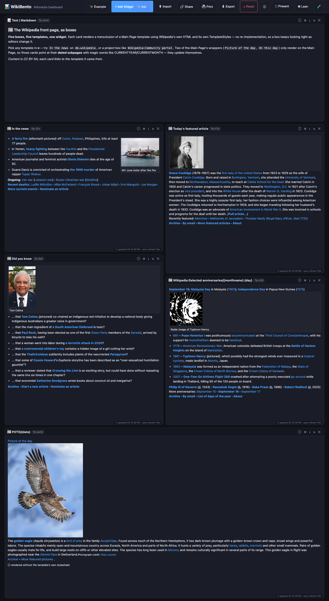

📰 **Wikipedia boxes.** Five Wikipedia templates rendered with the wiki's own markup *and* its own TemplateStyles:
**In the news** (the request), **Today's featured article**, **Did you know**, the day's **selected anniversaries**,
and the real **Picture of the day**. Nothing about the boxes' layout is re-implemented here — which is the point:
when an editor changes the box, these cards change with it. Two of them are dated (`POTD/{date}`,
`…/Selected anniversaries/{monthname} {day}`), so they stay current without anyone editing a board.

### 2026-09-16 — click through: from a box to another widget (ISSUE-91)

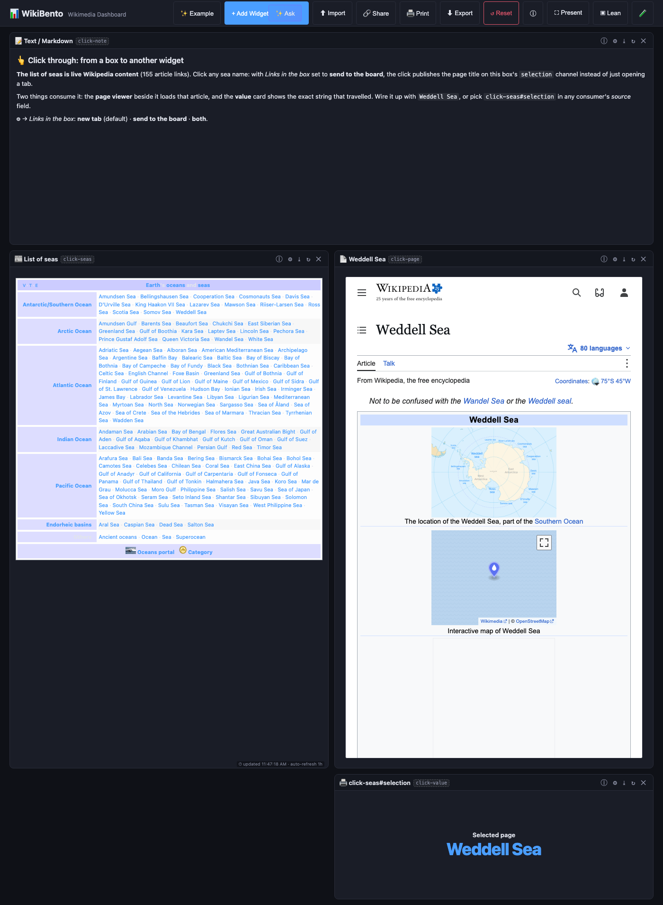

👆 **The reader's click is a choice, and the choice travels.** The left card is live Wikipedia content
(`{{List of seas}}`, 161 article links, rendered with the wiki's own markup and styles); *Links in the box* is set
to **send to the board**, so clicking **Weddell Sea** publishes the page title on the box's `selection` channel. The
page viewer on the right loads that article, and the Value Display card underneath shows the exact string that
travelled. Nothing is hard-wired on the consumer side: `{{widget:click-seas#selection}}` is all it takes.
